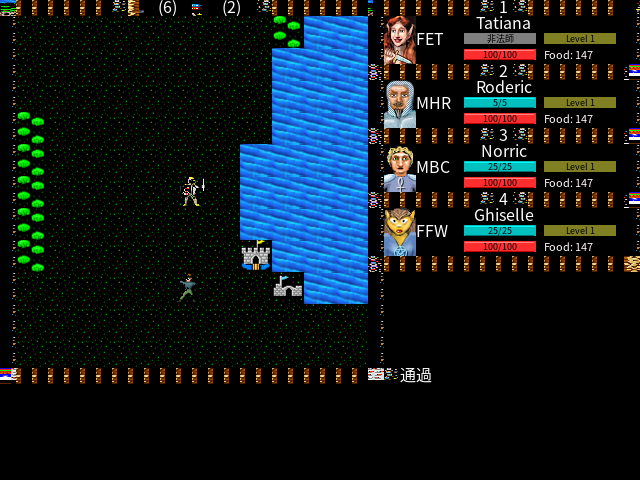
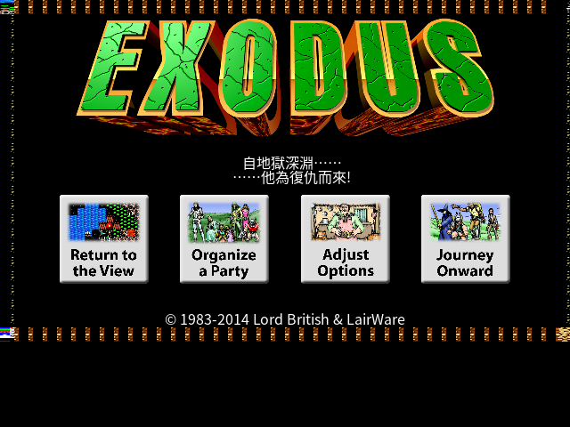

# Ultima III: Exodus 中文化 (u3-cht)

把官方授權的 [`beastie/ultima3`](https://github.com/beastie/ultima3)(LairWare Ultima III,MIT C 源碼)
從 Mac (Carbon/Cocoa/QuickDraw) 移植到 **SDL2**,並以 **UTF-8 + SDL_ttf(優質中文 TTF)** 全面中文化,
目標可在 Linux 執行遊玩。

> 詳細工程計畫見 [`PLAN.md`](PLAN.md);可行性分析見工作區的 `ultima3-中文化評估.md`。

## 截圖

| 世界地圖 + 隊伍 + 中文訊息 | 主選單 |
|---|---|
|  |  |

右側隊伍面板、底部訊息(如「通過」)、職業標籤(「非法師」)均為 SDL_ttf 中文渲染。

## 建置 (Docker first)

```bash
# 建映像
docker build -t u3cht docker/

# 編譯 (容器內,不污染系統)
docker run --rm -v "$PWD":/work u3cht \
  bash -c "cmake -S . -B build && cmake --build build -j"

# 跑 smoke 與 PoC (headless)
docker run --rm -v "$PWD":/work u3cht \
  bash -c "./build/hello_sdl && xvfb-run -a ./build/poc"
```

PoC 會輸出 `poc_out.png`:左側 tile 拼圖 + 右側中文文字,一次驗證
「繪圖換得掉 / 字型載得到 / 中文畫得出」三個最高風險假設。

## 狀態

| Phase | 內容 | 狀態 |
|---|---|---|
| P0 | repo 骨架 + Docker + smoke build | ✅ |
| P1 | 垂直切片 PoC (繪圖/字型/中文三假設) | ✅ |
| P2 | UltimaMacIF.c 移植稅盤點 | ✅ |
| P3a–d | compat 層 (型別/幾何/GWorld/CopyBits/CJK 文字/Carbon umbrella) | ✅ |
| P3e | 上游編譯狀態:6/11 檔對 compat 乾淨編譯 (含繪圖引擎) | ✅ |
| P4a | 字串管線 (.u3s) + 讀取器 + 端到端中文渲染 | ✅ |
| P5 | SDL 平台層 + 資源 fork 讀取器 + present:遊戲可執行並渲染 | ✅ |
| P5b | 遊戲內字串表文字渲染 (DrawThemeTextBox → SDL_ttf) | ✅ |
| P5d | 滑鼠點擊導航:可進入世界畫面 | ✅ |
| P6 | 字串表全量翻譯 (主要遊戲文字) | ✅ |
| P7 | 組隊→啟程→世界移動→戰鬥可玩流程 | ✅ |
| P7e | 底部文字滾動區中文亂碼根因修正 (UPrint & 0x7F 砍 UTF-8) | ✅ |
| 後續 | 進城鎮/地城 + NPC 對話中文化 / 存檔 / 選單按鈕圖片中文化 / 翻譯潤飾 | 進行中 |

詳見 `docs/P3-compat-compile-status.md`、`docs/GAMEPLAY-STATUS.md`。截圖見 `docs/screenshots/`。

## 執行 (容器內)

```bash
docker build -t u3cht docker/
docker run --rm --user "$(id -u):$(id -g)" -v "$PWD":/work u3cht bash /work/u3-cht/tools/build_game.sh
# 背景測試 (game tester):截圖 + 腳本輸入
docker run --rm --user "$(id -u):$(id -g)" -v "$PWD":/work -e XDG_RUNTIME_DIR=/tmp u3cht \
  bash tools/game_tester.sh build/u3 20 tests/scripts/tomenu.txt
```

## 授權

* 程式碼:MIT(沿用上游 © Leon McNeill,移植與中文化部分同 MIT)。
* 非程式資產(美術/音樂/字串)源自原作,著作權屬原權利人;本專案採引擎與資料分離,自用為主。
