# Ultima III: Exodus 繁體中文化 (u3-cht)

把 **MIT 授權**的 [`beastie/ultima3`](https://github.com/beastie/ultima3)
(LairWare 的 Ultima III Mac 版,Leon McNeill 以 MIT 釋出的 C 源碼)從
Mac(Carbon / Cocoa / QuickDraw)移植到 **SDL2**,並以 **UTF-8 + SDL_ttf(Noto Sans CJK)**
將**主要介面、對話、狀態、種族/職業說明圖繁體中文化**(預設西式角色名與少數鍵名如
`Enter` 保留原文),可在 **Linux(AppImage)** 與 **Windows** 執行遊玩。

本 repo 同時是一份 **Ultima III 繁體中文參考入口**:除了可玩的移植版,也整理了
世界觀、人物、發行史、台灣流通查證、在地化筆記與入門導覽(見下方
[Ultima III 中文知識庫](#-ultima-iii-中文知識庫))。

> 人生總該做點事情留下紀念。  
>  
> 希望這些中文翻譯，能讓後來的人更容易認識那些經典 RPG，知道它們曾經有多迷人。

> 《Ultima III: Exodus》(EA 官方繁中名 **《創世紀3:魔胎》**)由 Richard Garriott 設計、
> 1983 年 Origin Systems 於 Apple II 發行,是「黑暗時代三部曲」終章。玩家組成**四人隊伍**,
> 在 **Sosaria(索薩利亞)** 追查並終結 Mondain 與 Minax 的造物 **Exodus**。
> 完整背景見 [世界觀導讀](docs/ultima-iii-overview.md)。

---

## 📸 截圖(繁中化後)

| 主選單 / 標題 | 調整選項 |
|---|---|
| 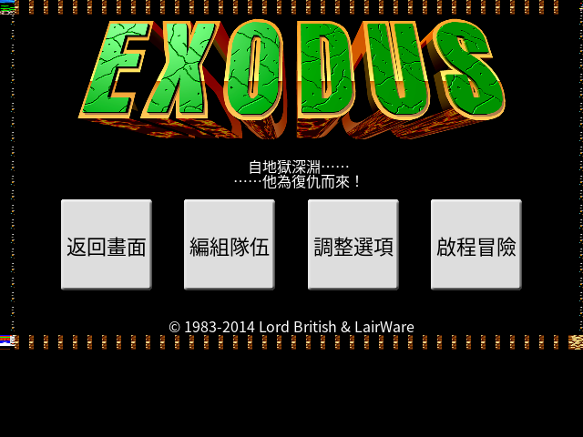 | 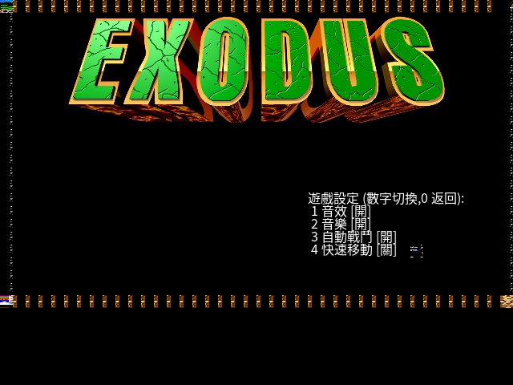 |

| 世界地圖 + 隊伍 sidebar | 進入城堡(內部) |
|---|---|
| 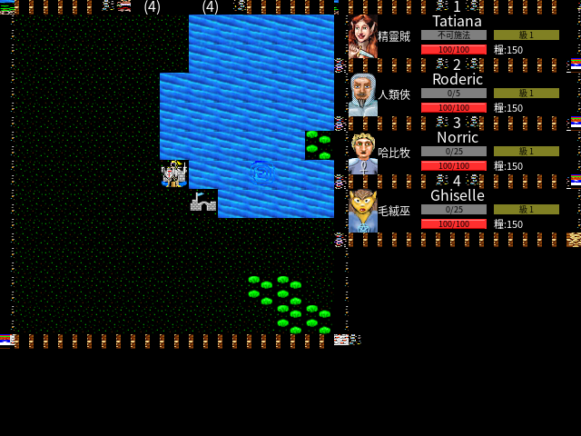 | 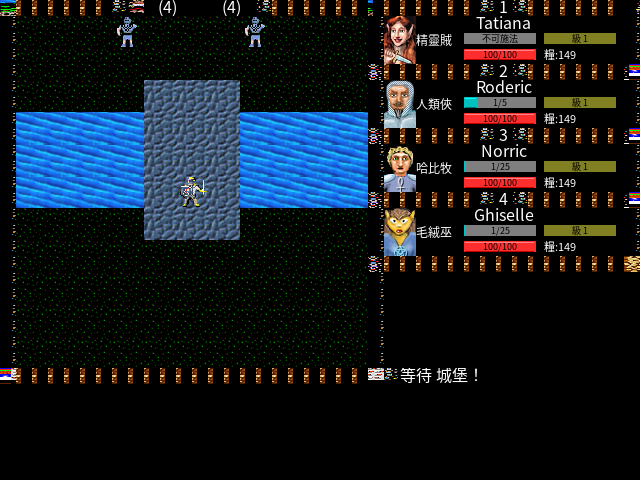 |

| 創角 + 種族/職業說明(中文) | 種族屬性 / 職業說明圖(中文) |
|---|---|
| 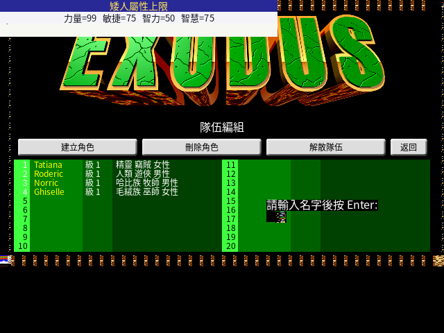 | 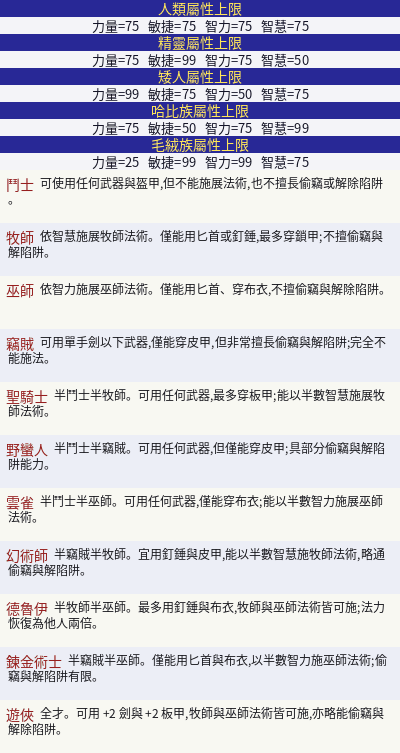 |

右側隊伍面板顯示**種族+職業短碼**(精靈賊 / 人類俠 / 哈比牧 / 毛絨巫)、等級「**級**」、
食物「**糧**」、無法力職業標「**不可施法**」;底部訊息(如「**等待**」)、選單、創角、
城堡/城鎮、種族職業說明圖均為中文。

> 截圖中**預設隊伍角色名**(Tatiana / Roderic / …)為原西式專有名詞、創角輸入提示中的
> 鍵名 `Enter` 保留原文——詳見 [已知限制](#️-已知限制)。

### 🎨 復古顏色模式(遊戲內按 `F2` 即時切換)

仿單色顯示器 / CRT 觀感的 **renderer 層濾鏡**(取畫面亮度後重新上色),不改 tileset,
中文與畫面一起轉換 → 單色風格統一。按 **`F2`** 循環四種模式,即時生效並記住設定
(`ColorMode` 偏好):

| 彩色(預設) | 綠磷光(Apple II 單色屏) |
|---|---|
| 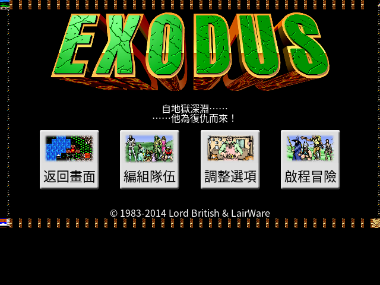 | 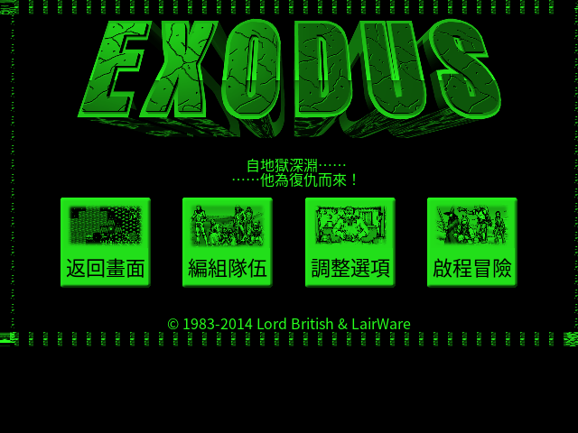 |

| 琥珀(amber CRT) | 灰階 |
|---|---|
| 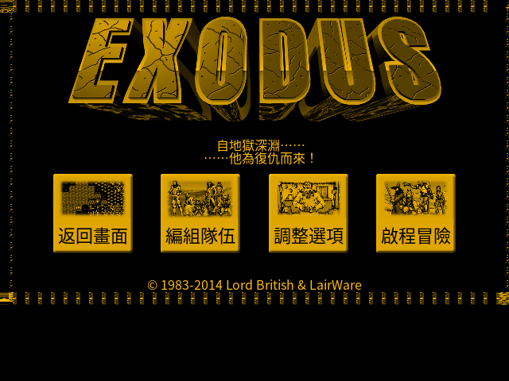 | 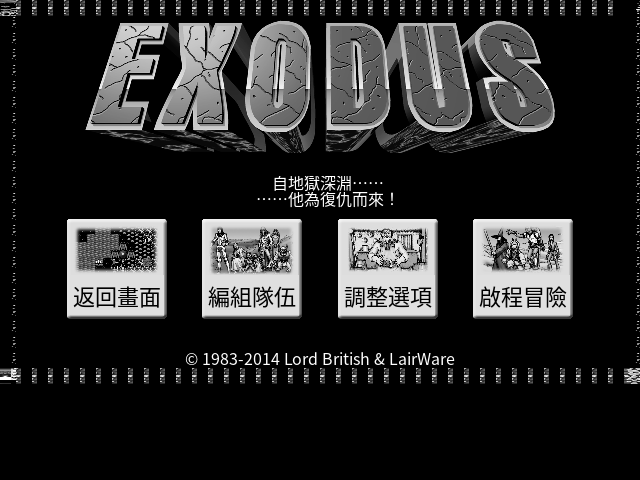 |

綠磷光世界地圖實機(中文 sidebar 一併轉為單色):

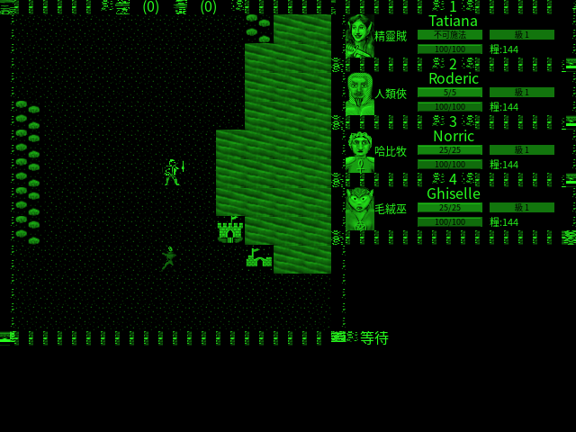

### 🖼️ 多平台圖塊組(遊戲內按 `F3` 即時切換)

復刻原版收錄的**多平台 tile 美術**,遊戲內按 **`F3`** 循環,即時生效並記住設定
(`TileSetIdx` 偏好):**標準 → PC VGA → PC EGA → PC CGA → Commodore 64 →
Apple II 彩色 → Apple II 單色 → Macintosh 黑白 → NES**。中文 UI / 字型不受影響。

| 標準(預設) | PC VGA(DOS 256 色) |
|---|---|
| 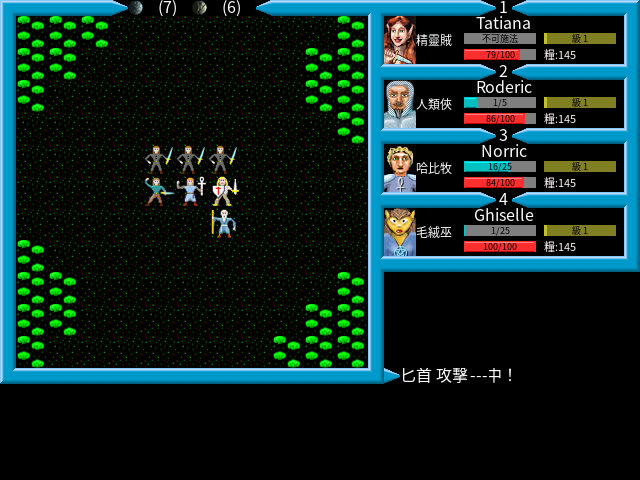 | 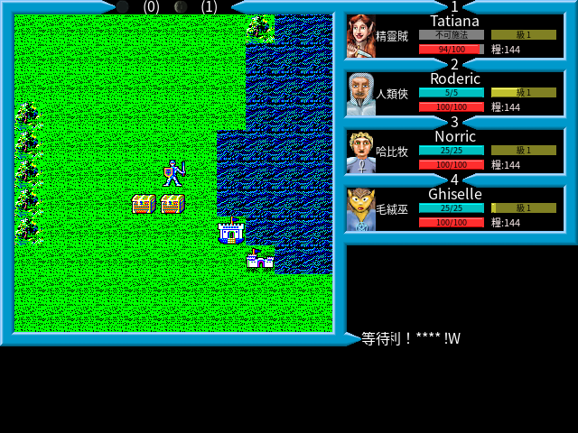 |

| PC MCGA(DOS 256 色) | PC EGA(DOS 16 色) |
|---|---|
| 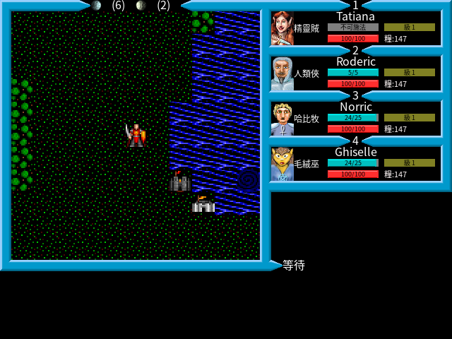 | 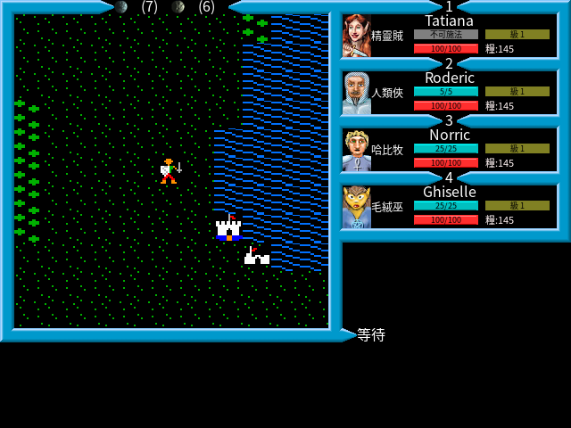 |

| Commodore 64(紫框配色) | Apple II 單色(原始綠磷光線條) |
|---|---|
| 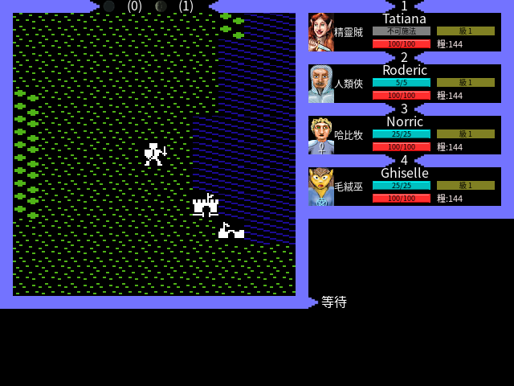 | 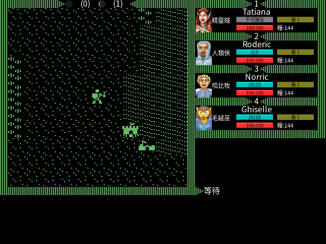 |

> **Apple II 單色**是原版**原始美術**(綠磷光線條 tile),與 F2 的綠磷光「濾鏡」不同;
> 兩者可疊加 —— F2 對任意 tileset 套色、F3 換原始平台美術。同一世界位置、同樣的中文
> sidebar / 底部訊息,在每種圖塊組下都正確顯示。

> 註:此功能依賴上游 `GetGraphics()` 的多平台 tileset 切換機制。移植初期因
> `mac_shim.h` 缺 CF 函式 prototype,上游隱式宣告回 `int` 截斷了 64-bit 指標,
> 導致目錄掃描錯亂、只能載入 Standard;補上 prototype 後全平台 tileset 正確渲染。
> 詳見 [`docs/單色模式評估.md`](docs/單色模式評估.md)。

---

## ⬇️ 下載與執行(Release)

預先打包的可執行檔請至 **[Releases 頁面](https://github.com/wicanr2/u3-cht/releases/latest)**
下載(大型二進位不入 git,改以 GitHub Release 發布)。

### Linux — AppImage
```bash
chmod +x Ultima3-CHT-x86_64.AppImage
./Ultima3-CHT-x86_64.AppImage
```
- 自含 SDL 相依與遊戲資料(含中文字型與繁中 RaceClassInfo 圖),於 Ubuntu 22.04+ 可執行。
- 無音訊裝置時只警告、停用音效,遊戲仍可玩。

### Windows — zip
```text
解壓 Ultima3-CHT-windows-x64.zip,執行其中的 .exe。
```

> 也可依下節「**從原始碼建置**」自行產生 `dist/` 內的可執行檔。

---

## 🎮 遊戲操作 / 指令

- **遊戲內按 `F1`** 隨時叫出 / 關閉指令表說明視窗(再按 `F1` 或任意鍵關閉)。
- **遊戲內按 `F2`** 循環畫面顏色模式:彩色 → 綠磷光 → 琥珀 → 灰階(見上方 [復古顏色模式](#-復古顏色模式遊戲內按-f2-即時切換),設定會記住)。
- **遊戲內按 `F3`** 循環多平台圖塊組:標準 → DOS (VGA/EGA/CGA) → C64 → Apple II → Mac 黑白 → NES(見上方 [多平台圖塊組](#️-多平台圖塊組遊戲內按-f3-即時切換),設定會記住)。
- **移動**:方向鍵。**`空白`**:等待一回合(原 Pass)。
- **進城 / 城堡 / 地城**:走到該地圖格上,按 **`E`**(進入)。起點旁即有城堡與城鎮。
- **調整選項**:主選單「調整選項」可切換 `1` 音效 / `2` 音樂 / `3` 自動戰鬥 / `4` 快速移動 /
  **`5` 速度(慢/中/快)**。速度預設「慢」(最接近 8086 DOS 慢板),設定即時生效並保存。

### 指令一覽(世界 / 城鎮 / 地城,對應原 A–Z)

| 鍵 | 指令 | 鍵 | 指令 | 鍵 | 指令 |
|---|---|---|---|---|---|
| `A` | 攻擊 | `J` | 分配金幣 | `S` | 偷竊 |
| `B` | 登乘(船/馬/載具) | `K` | 攀爬(上/下樓) | `T` | 交談 / 交易 |
| `C` | 施展法術 | `L` | 查看(地城) | `U` | 開鎖 |
| `D` | 下樓(地城) | `M` | 調整隊伍順序 | `V` | 音量 |
| `E` | 進入城鎮/城堡/地城 | `N` | 停止時間(權杖) | `W` | 穿戴防具 |
| `F` | 發射船炮 | `O` | 其他指令 | `X` | 離開載具 / 下船 |
| `G` | 開啟寶箱 | `P` | 以寶石俯瞰地圖 | `Y` | 呼喊(升/降帆) |
| `H` | 取用裝備 | `Q` | 存檔 | `Z` | 角色狀態(Ztats) |
| `I` | 點火把 | `R` | 備妥武器 | `空白` | 等待一回合 |

> 大小寫皆可。方向鍵移動;戰鬥中以方向鍵指定攻擊 / 施法目標。

---

## 🛠️ 從原始碼建置(Docker first)

一律於容器內 build/test,不污染宿主環境。

> **目錄佈局(重要)**:建置腳本內部使用 `/work/u3-cht`(本 repo)與 `/work/ultima3`(上游 C 源碼)
> 兩個絕對路徑,因此 **掛載的是 repo 的「上一層」目錄**(其中需同時有 `u3-cht` 與 `ultima3` 兩個資料夾):
> ```bash
> 父目錄/
> ├── u3-cht/    # 本 repo(git clone 本專案)
> └── ultima3/   # 上游 LairWare 源碼(git clone https://github.com/beastie/ultima3)
> ```
> 以下指令請在 **repo 根目錄(`.../父目錄/u3-cht`)** 執行;`"$(dirname "$PWD")"` 即父目錄。

```bash
# 1) 建映像
docker build -t u3cht docker/

# 2) 編譯遊戲 → build/u3 (掛載父目錄;HOSTUID/HOSTGID 讓產物 chown 回宿主)
docker run --rm -e HOSTUID=$(id -u) -e HOSTGID=$(id -g) \
  -v "$(dirname "$PWD")":/work u3cht bash /work/u3-cht/tools/build_game.sh

# 3) 打包 AppImage (Ubuntu 22.04 容器,自動重生繁中 RaceClassInfo.gif)
docker run --rm -e HOSTUID=$(id -u) -e HOSTGID=$(id -g) \
  -v "$(dirname "$PWD")":/work ubuntu:22.04 bash /work/u3-cht/tools/package_appimage.sh
```

---

## ✅ 測試 / 驗證

> 同樣掛載父目錄(`-v "$(dirname "$PWD")":/work`),在 repo 根目錄執行。

```bash
# 單元測試 (cmake + ctest)。host 缺 sdl2 pkg-config 時請於容器內跑:
docker run --rm -v "$(dirname "$PWD")":/work u3cht bash /work/u3-cht/tools/run_tests.sh

# 整合 smoke (容器內 build + 腳本驅動截圖,斷言不崩潰且持續渲染)
docker run --rm -e HOSTUID=$(id -u) -e HOSTGID=$(id -g) \
  -v "$(dirname "$PWD")":/work -w /work/u3-cht \
  u3cht bash tools/build_and_verify.sh tests/scripts/smoke.txt 45 15

# AppImage release smoke (可從 repo 外任意 cwd 跑,需 host 有 xvfb-run)。
# 以 [SCENE] 標記斷言:主選單 / 選項 / 編組 / 世界 / 城堡 五場景皆抵達。
bash /絕對路徑/u3-cht/tools/smoke_appimage.sh
```

> `run_tests.sh` 需 SDL2 開發環境;**宿主缺 `sdl2` pkg-config 時請改用上面的 `u3cht` 容器**,
> 本機直接跑失敗屬環境缺依賴,非專案問題。
> 測試掛勾(僅測試用,正式版不啟用):`U3_SKIPINTRO`、`U3_DBG_SCENE`、`U3_TELEPORT` 等,
> 細節見 [在地化筆記 · 測試與截圖](docs/localization-notes.md#測試與截圖注意事項)。
>
> **臨時產物清理**:`build_and_verify.sh` 會把 `tests/shots/` 等截圖產物 chown 回宿主
> (需傳 `HOSTUID`/`HOSTGID`),`build_game.sh` 亦把 `build/` chown 回宿主;`tests/shots/`、
> `tests/_*`、`build/`、`dist/` 皆 `.gitignore`,跑完可直接 `rm -rf tests/shots tests/_*` 清理。

---

## 📚 Ultima III 中文知識庫

完整知識庫附 **[總目錄與閱讀路線 → docs/README.md](docs/README.md)**(新玩家 / 歷史考證 /
中文化技術 / 台灣查證 四條路線 + 來源與版權原則)。以原創中文整理、附參考來源;
不收錄受版權保護的原始手冊全文。

| 文件 | 內容 |
|---|---|
| 📑 **[知識庫總目錄](docs/README.md)** | **閱讀路線、全文件索引、來源層級與版權原則** |
| [世界觀與故事背景](docs/ultima-iii-overview.md) | Sosaria、黑暗時代三部曲、Exodus、火焰之島、為何重要 |
| [人物與勢力](docs/characters-and-factions.md) | Lord British、Mondain、Minax、Exodus、自建四人隊伍、種族/職業 |
| [發行與移植史](docs/release-history.md) | Garriott / Origin、1983 Apple II 原版、多平台移植、在地化 |
| [版本與平台差異](docs/versions-and-platforms.md) | 各平台移植差異、**LairWare Mac 版** 與本專案的關係與改造對照 |
| [時間線與來源層級](docs/timeline.md) | 1981→今年代表,每條標來源層級;台灣查證狀態表 |
| [台灣發行/流通查證](docs/taiwan-history.md) | 官方中文名;精訊/第三波 屬**收藏者紀錄(非官方代理證明)**;**未查到可靠發行年份** |
| [在地化筆記](docs/localization-notes.md) | 翻譯原則、名詞對照、字型/SDL/AppImage、踩雷與測試掛勾 |
| [入門玩法導覽](docs/gameplay-guide.md) | 主選單、創角、種族職業、操作、初期目標 |

> 台灣發行年份/授權狀態目前**未能查到可靠公開資料**證實,相關段落採保守措辭並列出查證方法,
> 詳見 [taiwan-history.md](docs/taiwan-history.md)。

---

## 🧩 專案技術重點

- **compat shim**(`src/compat/`):以 SDL2 重建 QuickDraw / Mac Toolbox,上游 C 遊戲邏輯
  幾乎不改即可編譯(見 `docs/adr/`)。
- **文字單一出口**:全遊戲繪字收斂於 `UDrawThemePascalString` → SDL_ttf CJK,一處替換即全中文。
- **字串外部化**:`.u3s`(UTF-8)字串表,由 `tools/extract_strings.py` 從 `translations/*.json` 產生;
  未翻譯自動回退英文。
- **美術中文化**:`tools/make_raceclass_gif.py` 重繪繁中種族/職業說明圖,打包時自動重生。

開發歷程與可玩性狀態見 [`docs/GAMEPLAY-STATUS.md`](docs/GAMEPLAY-STATUS.md);
編譯移植細節見 [`docs/P3-compat-compile-status.md`](docs/P3-compat-compile-status.md)。

---

## ⚠️ 已知限制

- **角色預設名**:範例隊伍角色名(Tatiana/Roderic/…)保留原西式專有名詞;種族/職業/狀態/
  數值欄位皆已繁中。
- **少數鍵名**:創角輸入提示中的鍵名 `Enter` 保留原文(屬實體按鍵名稱);提示句其餘為中文
  (如「請輸入名字後按 Enter:」)。
- **隊伍面板寬度**:右側 sidebar 空間有限,種族+職業以短碼呈現(完整名見「編組隊伍」名冊)。
- **音樂**:原始 `.mov`(QuickTime Music,類 MIDI)非取樣音訊,SDL_mixer 不直接支援,
  目前以安全 stub 處理(音效已可用)。
- **台灣發行考證**:見上,年份/授權待第一手資料補充。

---

## 📄 授權

- **程式碼**:MIT(沿用上游 © Leon McNeill,移植與中文化部分同 MIT)。
- **非程式資產**(美術/音樂/字串)源自原作,著作權屬原權利人(現 IP 屬 EA);
  本專案採「引擎與資料分離」,以自用與技術研究為主。
- 知識庫文件為原創中文整理,引用之事實均附參考來源連結。
